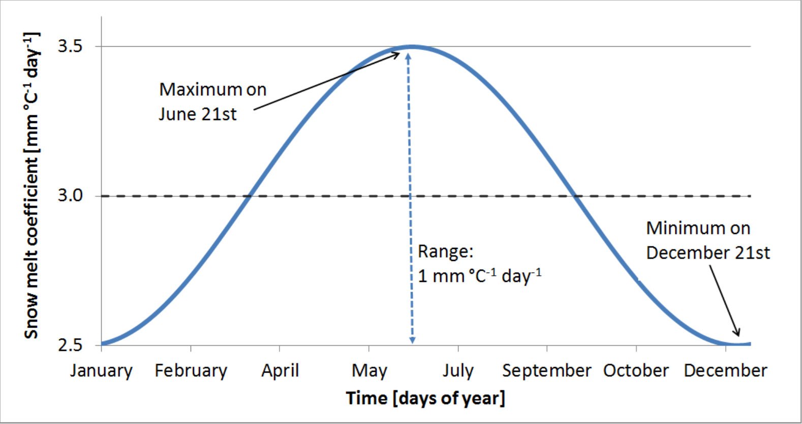
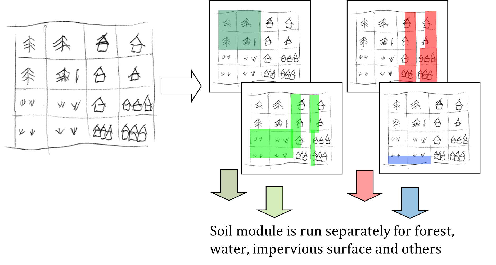

######################
Hydrological processes
######################

.. contents:: 
    :depth: 3

| Most of the text and figures are taken from 
| Burek, P., Van Der Knijff, J., & de Roo, A. P. J. D. (2013). LISFLOOD distributed water balance and flood simulation model. Revised user manual. doi:10.2788/24719
| https://publications.jrc.ec.europa.eu/repository/handle/JRC78917
| and adjusted to the CWatM model

.. warning:: Under construction! Might contain writing errors and misspellings. Keep away from small children!

Rain and Snow and Melt
======================

If the average temperatur is below 1°C, all precipitation is assumed to be snow. A snow correction factor is used to correct for undercatch of snow precipitation. Unlike rain, snow accumulates on the soil surface until it melts. The rate of snowmelt is estimated using a simple degree-day factor method. Degree-day factor type snow melt models usually take the following form (e.g. see WMO, 1986):

:math:`M = C_m (T_{avg} - T_m)`  (1)

where M  is the rate of snowmelt, Tavg is the average daily temperature, Tm is some critical temperature and Cm is a degree-day factor [mm °C-1 day-1]. Speers et al. (1979) developed an extension of this equation which accounts for accelerated snowmelt that takes place when it is raining (cited in Young, 1985). The equation is supposed to apply when rainfall is greater than 30 mm in 24 hours. Moreover, although the equation is reported to work sufficiently well in forested areas, it is not valid in areas that are above the tree line, where radiation is the main energy source for snowmelt).  LISFLOOD uses a variation on the equation of Speers et al. The modified equation simply assumes that for each mm of rainfall, the rate of snowmelt increases with 1% (compared to a ‘dry’ situation). This yields the following equation:

:math:`M = C_m \cdot C_{\text{Seasonal}} \cdot (1 + 0.01 \cdot R \cdot \Delta t) \cdot (T_{\text{avg}} - T_m) \cdot \Delta t`  (2)

where M is the snowmelt per time step [mm], R is rainfall (not snow!) intensity [mm day-1], and Δt is the time interval [days]. Tm has a value of 0 °C, and Cm is a degree-day factor [mm °C-1 day-1]. However, it should be stressed that the value of Cm can actually vary greatly both in space and time (e.g. see Martinec et al., 1998). 
Therefore, in practice this parameter is often treated as a calibration constant. A low value of Cm indicates slow snow melt. CSeasonal is a seasonal variable melt factor which is also used in several other models (e.g. Anderson 2006, Viviroli et al., 2009). There are mainly two reasons to use a seasonally variable melt factor:
-	The solar radiation has an effect on the energy balance and varies with the time of the year.
-	The albedo of the snow has a seasonal variation, because fresh snow is more common in the mid winter and aged snow in the late winter/spring. This produce an even greater seasonal variation in the amount of net solar radiation

Figure 1 shows an example where a mean value of: 3.0 mm °C-1 d-1is used. The value of Cm is reduced by 0.5 at 21st December and a 0.5 is added on the 21st June. In between a sinus function is applied

	
Figure 1 Sinus shaped snow melt coefficient (Cm) as a function of days of year

At high altitudes, where the temperature never exceeds 1ºC, the model accumulates snow without any reduction because of melting loss. In these altitudes runoff from glacier melt is an important part. The snow will accumulate and converted into firn. Then firn is converted to ice and transported to the lower regions. This can take decades or even hundred years. In the ablation area the ice is melted. In LISFLOOD this process is emulated by melting the snow in higher altitudes on an annual basis over summer. A sinus function is used to start ice melting in summer, starting on the 15 June and ending on the 15 September (see fig 2) and using the temperature of elevation zone 3 (see fig 3)

.. image:: _static/82_icemelt.png
    :width: 600px

Figure 2 Sinus shaped ice melt coefficient as a function of days of year

The amount of snowmelt and icemelt together can never exceed the actual snow cover that is present on the surface.

For large cell sizes, there may be considerable sub-cell heterogeneity in snow accumulation and melt, which is a particular problem if there are large elevation differences within a cell. Because of this, snow melt and accumulation are modelled separately for different elevation zones, which are defined by the percentiles of sub-cell elevation.
The division in elevation zones is done by calculating the percentiles of a high resolution DEM inside the resolution  of the CWatM cell. e.,g 3 arcsec SRTM DEM cell in a 5 arcmin grid cell. 
Depending on the elevetion zones (e.g. 0.0065 °C) per meter elevation difference. Snow, snowmelt and snow accumulation are subsequently modelled separately for each elevation zone.

Frost Index
===========

When the soil surface is frozen, this affects the hydrological processes occurring near the soil surface. To estimate whether the soil surface is frozen or not, a frost index F is calculated. The equation is based on Molnau & Bissell (1983, cited in Maidment 1993), and adjusted for variable time steps. The rate at which the frost index changes is given by: 

:math:`\frac{dF}{dt} = -(1 - A_f)F - T_{av} \cdot e^{-0.04 \cdot K \cdot \frac{d_s}{we_s}}`  (3)

dF/dt  is expressed in [°C day-1 day-1 ].  Af is a decay coefficient [day-1], K is a a snow depth reduction coefficient [cm-1], ds is the (pixel-average) depth of the snow cover (expressed as mm equivalent water depth), and wes is a parameter called snow water equivalent, which is the equivalent water depth water of a snow cover (Maidment, 1993). In LISFLOOD, Af and K are set to 0.97 and 0.57 cm-1 respectively, and wes is taken as 0.1, assuming an average snow density of 100 kg/m3    (Maidment, 1993). The soil is considered frozen when the frost index rises above a critical threshold of 56.  For each time step the value of F [°C day-1] is updated as:

:math:`F(t) = F(t-1) + \frac{dF}{dt} \Delta t`  (4)

F is not allowed to become less than 0. When the frost index rises above a threshold of 56, every soil process is frozen and transpiration, evaporation, infiltration and the outflow to the second soil layer and to upper groundwater layer is set to zero. Any rainfall is bypassing the soil and transformed into surface runoff till the frost index is equal or less than 56. To prevent that the soil is frozen for a too long period, a maximimum F can bedefined (e.g. 60) where F is not allowed to become more.

Adressing sub-grid variability in land cover
============================================

In hydrological model a number of parameters are linked directly to land cover classes by using lookup tables. In some models the spatially dominant value is used to assign the corresponding grid parameter values. This implies that some of the sub-grid variability in land use, and consequently in the parameter of interest, is lost (figure 4)

.. image:: _static/82_dominant_landcover.png
    :width: 600px

Figure x: Land cover aggregation approach with dominant land cover

To account for the sub-grid variability in land use, CWatM models the within-grid variability. In the modified version of the hydrological model, the spatial distribution and frequency of each class is defined as a percentage of the whole represented area of the new pixel. Combining land cover classes and modeling aggregated classes, is known as the concept of hydrological response units (HRU). The logic behind this approach is that the non-linear nature of the rainfall runoff processes on different land cover surfaces observed in reality will be better captured. This concept is also used in models such as SWAT (Arnold and Fohrer, 2005) and PREVAH (Viviroli et al., 2009). CWatM is using a HRU approach on sub-grid level, as shown in figure 6.

Figure 6  CWatM land cover aggregation by modelling aggregated land use classes separately: Percentages of forest (dark green); water (blue), impervious surface (red), other classes (light green)

Soil model
==========

If a part of a cell is made up of built-up areas this will influence that cell’s water-balance. CWatM’s ‘sealed fraction’ variable defines the fraction of a pixel that is impervious.  For impervious areas, CWatM assumes that:
1.	A depression storage is filled by precipitation and snowmelt and emptied by evaporation
2.	Any water that is not filling the depression storage, reaches the surface is added directly to surface runoff
3.	The storage capacity of the soil is zero (i.e. no soil)
4.	There is no groundwater storage

For open water (e.g. lakes, rivers) the water fraction variable defines the fraction that is covered with water (large lakes that are in direct connection with major river channels can be modelled using CWatM’s lake or reservoir option. It is assumed that:
1.	The loss of actual evaporation is equal to the potential evaporation on open water
2.	Any water that is not evaporated, reaches the surface is added directly to surface runoff
3.	The storage capacity of the soil is zero (i.e. no soil moisture storage in the water fraction)
4.	There is no groundwater storage

For the part of a cell that is forest, other land cover, irrigated land, or paddy irrigated land the description of all soil- and groundwater-related processes below (evaporation, transpiration, infiltration, preferential flow, soil moisture redistribution and groundwater flow) are valid. While the modelling structure for forest and other classes is the same, the difference is the use of different map sets for crop coefficient index.

CWatM calculates for every land cover class the soil fluxes, even if there is not such a land cover class in that cell. The model will then calculate the real fluxes based on the corresponding land cover class fraction. As result of the soil model you get six different surface fluxes weighted by the corresponding fraction (forest, other, irrigated, paddy irrigated, water and sealed), respectively four fluxes percolating to the groundwater zone (forest, other, irrigated, paddy irrigated).

Interception
============

Interception is estimated using the following storage-based equation (Aston, 1978, Merriam, 1960):

:math:`\text{Int} = S_{\max} \cdot \left[1 - e^{\frac{-k \cdot R \cdot \Delta t}{S_{\max}}}\right]`

where Int [mm] is the interception per time step, Smax [mm] is the maximum interception, R is the rainfall intensity [mm day-1] and the factor k accounts for the density of the vegetation. Smax is calculated using an empirical equation (Von Hoyningen-Huene, 1981):

:math:`S_{max} = 0.935 + 0.498 \cdot LAI - 0.00575 \cdot LAI^2` for :math:`LAI > 0.1`

:math:`S_{max} = 0` for :math:`LAI \leq 0.1`

where LAI is the average Leaf Area Index [m2 m-2] of each model element (pixel). k is estimated as:

  
The value of Int can never exceed the interception storage capacity, which is defined as the difference between Smax and the accumulated amount of water that is stored as interception, Intcum. 

Evaporation
===========

:math:`{D\left(\frac{1}{T_{\text{int}}}\right)_{\text{cum}}}_{\text{int}}`